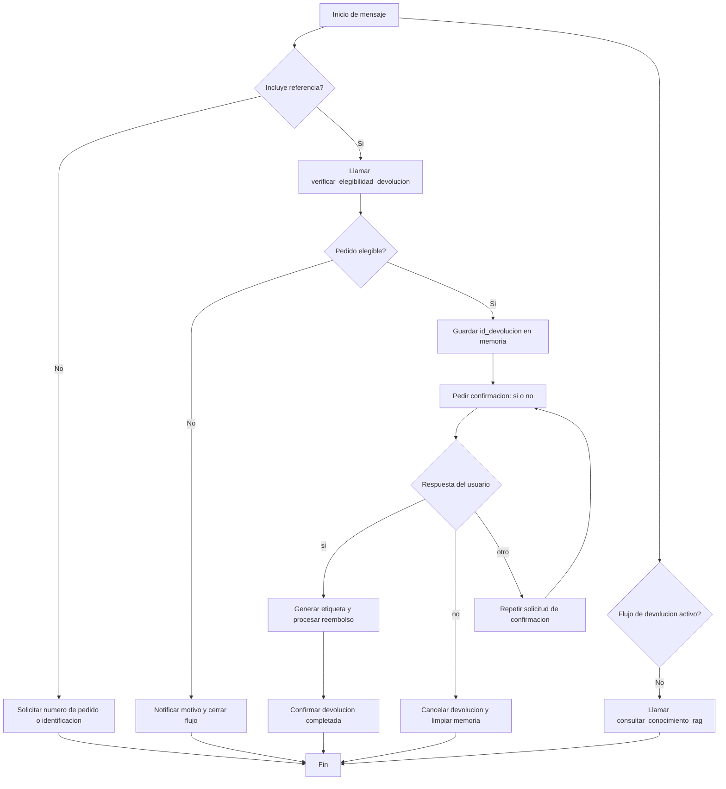

<h1> </h1>
<h1>📚 Maestría en Inteligencia Artificial Aplicada – 3er Semestre</h1>

<h3>Asignatura: Inteligencia Artificial Generativa</h3>

<h3>Taller Final</h3>

<hr style="width:60%;">

<h3>👨‍🎓 Estudiantes</h3>
<ul style="list-style:none; padding:0; font-size:18px;">
    <li>Sebastián Murillas</li>
    <li>Octavio Guerra</li>
</ul>

<hr style="width:60%;">

<h3>📅 Fecha: Octubre 28, 2025</h3>


# 🤖 EcoMarket - Sistema de Agente Inteligente para Consultas y Devoluciones

Este proyecto implementa un asistente inteligente capaz de **gestionar devoluciones de pedidos** dentro del entorno de EcoMarket.  
El agente utiliza un modelo conversacional y herramientas simuladas para verificar si un pedido es elegible para devolución, generar la etiqueta de envío y procesar el reembolso. Y adicional, permite que el cliente o usuario haga consultas generales que son respondidas usando la base datos RAG que se ha preparado con documentos de la compañia EcoMarket.

---

# Fase I. Diseño de la Arquitectura del Agente.

## 🧰 Herramientas del Agente (Tools)

El agente utiliza funciones simuladas para interactuar con los sistemas internos de EcoMarket.  
Estas funciones son llamadas **"Herramientas"** y permiten que el agente tome decisiones y ejecute acciones.

A continuación las describimos:

---

### 1. `verificar_elegibilidad_devolucion(id_referencia: str)`

**Objetivo:**  
Determinar si un pedido es elegible para devolución.

**Entrada:**

| Parámetro | Tipo | Descripción |
|---------|------|-------------|
| `id_referencia` | `str` | Puede ser el **ID del pedido** (ej. `P-1003`) o el **número de identificación del cliente** (8 dígitos). |

**Flujo que realiza:**
1. Verifica si el pedido existe.
2. Comprueba que haya sido **entregado**.
3. Valida que el plazo de devolución (30 días) no haya expirado.
4. Identifica qué productos son **retornables** según la política de EcoMarket.
5. Si todo es válido, genera un **ID único de devolución** (`DEV-xxxx`).

**Respuesta esperada:**
```json
{
  "success": true,
  "elegible": true,
  "razon": "El pedido P-1003 es elegible...",
  "productos_retornables": ["bolsas reutilizables"],
  "id_pedido": "P-1003",
  "id_devolucion": "DEV-a92f2043"
}
```

---

### 2. `generar_etiqueta_devolucion(id_devolucion: str, direccion_origen: str)`

**Objetivo:**  
Simular la generación de una **etiqueta de envío** para devolver el producto.

**Entrada:**

| Parámetro | Tipo | Descripción |
|---------|------|-------------|
| `id_devolucion` | `str` | Identificador único de devolución generado previamente. |
| `direccion_origen` | `str` | Dirección desde donde se recogerá el producto. |

**Salida:**

| Clave | Tipo | Descripción |
|-------|------|-------------|
| `tracking_id` | `str` | Código de rastreo del envío. |
| `url_etiqueta` | `str` | Enlace simulado al PDF de la etiqueta. |
| `mensaje` | `str` | Mensaje descriptivo y amigable. |

**Respuesta ejemplo:**
```json
{
  "success": true,
  "tracking_id": "TRK-12a9b35c",
  "url_etiqueta": "https://ecomarket.com/etiquetas/DEV-a92f2043.pdf",
  "mensaje": "Etiqueta generada. El tracking es TRK-12a9b35c."
}
```

---

### 3. `procesar_reembolso(id_devolucion: str)`

**Objetivo:**  
Simular el inicio del proceso de **reembolso** al cliente.

**Entrada:**

| Parámetro | Tipo | Descripción |
|---------|------|-------------|
| `id_devolucion` | `str` | Identificador único de devolución. |

**Salida:**
```json
{
  "success": true,
  "mensaje": "Reembolso procesado. El monto se reflejará en 3-5 días hábiles."
}
```

---

## 🧠 Resumen Visual del Proceso

| Paso | Acción | Herramienta Utilizada |
|-----|--------|----------------------|
| 1 | El cliente solicita devolución | *N/A (conversación)* |
| 2 | Se valida si el pedido puede devolverse | `verificar_elegibilidad_devolucion()` |
| 3 | Cliente confirma | *N/A (conversación)* |
| 4 | Se genera etiqueta de envío | `generar_etiqueta_devolucion()` |
| 5 | Se inicia el reembolso | `procesar_reembolso()` |

---

## Bases de Datos Simuladas
Para uso por las Herramientas se crearon dos (2) bases de datos simuladas
- Una para Productos de EcoMarket, llamada **PRODUCTOS_DB**, donde se encuentra si un producto es Retornable o no.
- Una para Pedidos de EcoMarket, llamada **PEDIDOS_DB**, donde se encuentran registros de pedidos hechos con su ID de pedido, su estado (Entregado, En preparacion, Cancelado, etc.), Los productos incluidos en el Pedido, ID y Nombre del Cliente que hizo el Pedido.

## 🎯 Beneficios del Enfoque

- Permite flujos **autónomos y guiados**.
- El agente **toma decisiones** según el contexto.
- Las herramientas encapsulan la lógica de negocio.
- La interfaz final puede ser desplegada fácilmente con **Streamlit o Gradio**.


## 🧠 Selección del Marco de Agentes

Para el desarrollo del agente inteligente encargado de gestionar el proceso de devoluciones en EcoMarket, se evaluaron dos frameworks ampliamente utilizados en el ámbito de la Inteligencia Artificial Generativa: **LangChain** y **LlamaIndex**.  

Luego del análisis comparativo, se seleccionó **LangChain** como el marco principal para la implementación del agente.

### 🎯 Justificación

El proyecto requiere que el asistente no solo responda preguntas mediante acceso a datos (RAG), sino que **también ejecute acciones concretas**, como:

- Verificar si un pedido es elegible para devolución.
- Generar una etiqueta de envío.
- Procesar un reembolso.

LangChain ofrece una estructura clara para trabajar con **agentes que utilizan herramientas (Tools)** y que pueden tomar decisiones basadas en la conversación. Su enfoque está orientado específicamente al **control autónomo del flujo de acciones**, lo que coincide directamente con los objetivos de este proyecto.

Por otro lado, **LlamaIndex** se destaca en la **gestión y recuperación avanzada de información**, pero su estructura para la definición de agentes con acciones es menos directa y requiere componentes adicionales. Por esto, LlamaIndex fue empleado únicamente como parte del sistema RAG en el Taller 2, pero no como framework principal del agente.

### 📊 Comparativa LangChain vs LlamaIndex

| Criterio | **LangChain** | **LlamaIndex** |
|---------|:-------------:|:--------------:|
| **Enfoque principal** | Orquestación de agentes + herramientas | Recuperación e indexación de información (RAG) |
| **Facilidad para definir herramientas (Tools)** | ✅ Muy alta | ⚠️ Posible, pero menos directa |
| **Modelo de agente con toma de decisiones** | ✅ Diseñado para esto | ⚠️ Se requiere configuración adicional |
| **Integración con RAG** | Compatible con varios motores RAG | ⭐ Excelente soporte nativo |
| **Curva de aprendizaje** | Moderada (agentes + memoria) | Baja para RAG, pero más alta para agentes |
| **Adecuación al proyecto** | ✅ Ideal para automatizar devoluciones y acciones | Útil pero no suficiente para el flujo autónomo |
| **Comunidad y soporte** | Muy amplia y activa | En crecimiento |

### ✅ Conclusión

Se seleccionó **LangChain** porque:

- Permite **modelar agentes que pueden tomar decisiones y ejecutar acciones**.
- Se ajusta perfectamente al flujo de **devolución automatizada**.
- Facilita la **integración con herramientas externas**, incluyendo las simuladas para este proyecto.
- Permite mantener una estructura clara, comprensible y escalable dentro del contexto académico.

## 🧰 Planificación del Flujo de Trabajo

La lógica conversacional está implementada en [`agente_ecomarket.py`](agente_ecomarket.py) y se apoya en las herramientas definidas en [`herramientas_ecomarket.py`](herramientas_ecomarket.py). El siguiente diagrama resume las decisiones principales del agente y cuándo invoca cada herramienta:




**Puntos clave del flujo:**
- El agente solo invoca `verificar_elegibilidad_devolucion()` cuando el mensaje incluye una referencia válida. Esto evita llamadas innecesarias y asegura que el usuario comparta su pedido o identificación.
- Mientras `EcomarketMemory.esperando_confirmacion` es `True`, se bloquean consultas al RAG (`consultar_conocimiento_rag`). El agente se centra en cerrar la devolución pidiendo una respuesta "sí/no".
- Ante una confirmación positiva, se ejecutan en cadena `generar_etiqueta_devolucion()` y `procesar_reembolso()` para entregar la etiqueta simulada y notificar el reembolso. Un "no" cancela la operación y restablece la memoria.
- Si el usuario realiza preguntas informativas y no hay una devolución pendiente, el agente consulta la base de conocimiento mediante RAG para complementar sus respuestas.

## ✨ Fase 3: Análisis Crítico y Propuestas de Mejora

En esta fase se evaluaron los aspectos de seguridad, ética y sostenibilidad de la solución, así como posibles líneas de evolución del agente desarrollado.

---

### 1. 🔐 Seguridad y Ética

La capacidad del agente para ejecutar acciones reales (como generar etiquetas de devolución o iniciar reembolsos) introduce riesgos que deben gestionarse cuidadosamente. Es fundamental asegurar que el agente **interprete correctamente la intención del usuario** antes de ejecutar cualquier acción automática.

Para reducir riesgos y garantizar un uso responsable del sistema, proponemos:

- **Validación de contexto e intención** antes de cualquier acción.
- **Controles de acceso y autenticación** para limitar quién puede activar funciones críticas.
- **Registro de auditoría** para asegurar trazabilidad de decisiones y acciones.
- **Evitar automatizar operaciones de alto impacto** (financieras o sobre datos personales) sin supervisión humana.
- **Cumplimiento de normativas de protección de datos** como Habeas Data (Colombia) o GDPR (Europa), garantizando el uso responsable de información personal.

Estos mecanismos contribuyen a la transparencia, explicabilidad y responsabilidad en el uso del agente.

---

### 2. 🩺 Monitoreo y Observabilidad

Para garantizar que el agente opere de manera confiable, es necesario implementar un sistema de monitoreo continuo. Este permitirá detectar fallos y mejorar el rendimiento del sistema con el tiempo.

Se propone:

- **Logging estructurado** de consultas, decisiones, herramientas invocadas y errores.
- **Dashboards de monitoreo** para visualizar métricas clave en tiempo real.
- **Alertas automáticas** ante fallos recurrentes o respuestas anómalas.
- Herramientas recomendadas: **LangWatch**, **Helicone** o **OpenDevin Monitor**.

Esto facilita la **detección temprana de problemas** y el ajuste progresivo del comportamiento del agente.

---

### 3. 🚀 Propuestas de Mejora

El agente puede evolucionar para cubrir más etapas del proceso de servicio y aumentar su autonomía:

| Mejora Propuesta | Descripción | Beneficio |
|------------------|-------------|-----------|
| **Agente de reemplazos** | Permite gestionar reemplazos automáticamente tras una devolución. | Reduce fricción y mejora experiencia del cliente. |
| **Integración con CRM** | Registra interacciones y actualiza datos del cliente automáticamente. | Favorece consistencia y sincronización de sistemas. |
| **Aprendizaje continuo** | Ajusta la base de conocimiento en función de preguntas frecuentes. | Hace el sistema más útil con el tiempo. |
| **Human-in-the-loop** | Intervención manual en decisiones de mayor impacto. | Aumenta seguridad y control en operaciones críticas. |

---

### ✅ Conclusión

La solución demuestra cómo un agente de IA puede **automatizar procesos reales** manteniendo un equilibrio entre eficiencia, seguridad y experiencia de usuario. Las propuestas de mejora permiten una evolución hacia sistemas más adaptativos, confiables y éticamente responsables.

---
